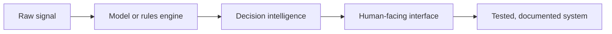

<p align="center">
  
</p>

<div align="center">

[](https://github.com/shauryamalhotra957-wq?tab=followers)
[](https://shaurya-malhotra-site.vercel.app/)
[](https://www.linkedin.com/in/shaurya-malhotra-048555367/)
[](mailto:shauryamalhotra957@gmail.com)
[](https://github.com/shauryamalhotra957-wq)
[](https://github.com/shauryamalhotra957-wq)

</div>

## Live Engineering Telemetry

<p align="center">
  
</p>

<table>
<tr>
<td width="50%">
  
</td>
<td width="50%">
  
</td>
</tr>
<tr>
<td width="50%">
  
</td>
<td width="50%">
  
</td>
</tr>
</table>

<p align="center">
  
</p>

### Technology Matrix

<p align="center">
  
</p>

---

## Engineering Thesis

```text
Sense real-world signals -> reason with transparent logic -> ship usable interfaces -> test the system.
```

I am a Computer Engineering undergraduate at Thapar Institute of Engineering and Technology focused on applied AI, embedded intelligence, automotive HMI, computer vision, and product-grade software systems.

The common thread across my projects is simple: **make intelligent systems inspectable, useful, and resilient enough to demo under real constraints.**

---

## Featured Systems

| Project | System Type | What It Shows | Proof |
| --- | --- | --- | --- |
| [Aegis Atlas](https://github.com/shauryamalhotra957-wq/aegis-atlas) | Disaster response simulator | Offline-first risk modeling, equity-aware resource planning, exportable incident briefs. | [Live demo](https://shauryamalhotra957-wq.github.io/aegis-atlas/) - CI - Pages deploy - visual QA |
| [Terra Sentinel](https://github.com/shauryamalhotra957-wq/terra-sentinel) | Humanitarian command center | Lifeline status, district risk, public warning drafts, resource allocation, coverage metrics. | CI - coverage - security audit - Pages deploy - desktop/mobile QA |
| [HELIX Command](https://github.com/shauryamalhotra957-wq/helix-command) | Digital twin simulator | 3D city operations, incident planning, policy comparison, recovery forecasting. | React - TypeScript - Three.js - Vitest |
| [JARVIS](https://github.com/shauryamalhotra957-wq/jarvis) | Futuristic assistant UI | Three.js Earth, satellite targeting, command parsing, local assistant core, responsive visuals. | Tests - build validation - verified screenshots |
| [GPT From Scratch Pro](https://github.com/shauryamalhotra957-wq/gpt-from-scratch-pro) | ML engineering project | Decoder-only Transformer, tokenizers, training loop, checkpoints, CLI, evaluation. | Pytest - Ruff - GitHub Actions |
| [NewsCred RAG](https://github.com/shauryamalhotra957-wq/newscred-rag) | Verification platform | Source scoring, claim extraction, local evidence retrieval, explainable verdicts. | Node tests - threat model - RAG docs |
| [AI Lecture Note Taker](https://github.com/shauryamalhotra957-wq/ai-lecture-note-taker) | FastAPI study tool | Transcript analysis, clean notes, concepts, quizzes, study guides, Markdown exports. | Pytest CI on Python 3.11 and 3.12 |
| [AI Highlight Reel Maker](https://github.com/shauryamalhotra957-wq/ai-highlight-reel-maker) | Media automation tool | FFmpeg workflow, highlight scoring, captions, titles, edit decision lists. | Pytest CI on Python 3.11 and 3.12 |

---

## Additional Engineering Repositories

| Project | Focus |
| --- | --- |
| [Aegis Earth](https://github.com/shauryamalhotra957-wq/aegis-earth) | Public-good disaster resilience command center with risk scoring, resource optimization, and a pitch deck. |
| [EcoConnect Vision](https://github.com/shauryamalhotra957-wq/EcoConnect-Vision) | Computer vision waste classifier using OpenCV motion isolation and a MobileNetV2 Keras model. |
| [Obstacle Avoiding Car](https://github.com/shauryamalhotra957-wq/Obstacle-Avoiding-Car) | Arduino robot car with ultrasonic sensing, median filtering, servo scanning, and turn verification. |
| [AutoFlora](https://github.com/shauryamalhotra957-wq/AutoFlora-An-IoT-Framework-for-Urban-Roadside-Plantation) | Smart roadside irrigation controller with soil, tank, flow, and weather-aware pump logic. |
| [Bank Customer Churn Prediction](https://github.com/shauryamalhotra957-wq/bank-customer-churn-prediction) | ML pipeline for feature engineering, model comparison, churn metrics, and saved predictions. |

---

## Build Tracks

<table>
<tr>
<td width="33%">

### AI Systems

- RAG and verification flows
- Computer vision prototypes
- Local deterministic AI engines
- Model training and evaluation tooling

</td>
<td width="33%">

### Command Interfaces

- Disaster response dashboards
- Digital twins and simulations
- Operator cockpit design
- Exportable decision briefs

</td>
<td width="33%">

### Embedded + Automotive

- Sensor-driven automation
- Human-machine interaction
- Edge AI concepts
- Automotive intelligence research

</td>
</tr>
</table>

---

## Technical Stack

| Area | Tools |
| --- | --- |
| Languages | Python, C, C++, JavaScript, TypeScript, Dart |
| AI / ML | PyTorch, TensorFlow, OpenCV, RAG pipelines, local inference logic |
| Frontend | React, Vite, Three.js, responsive UI systems |
| Backend | FastAPI, Node.js, local APIs, secure upload flows |
| Testing | Pytest, Vitest, Node test runner, Ruff, oxlint, Playwright visual QA |
| Hardware | Arduino, sensors, actuators, IoT prototyping, embedded concepts |

---

## Engineering Standards

```cpp
class EngineeringStandard {
public:
    string design = "Clear interface, clear hierarchy, clear user outcome.";
    string build = "Small enough to inspect, strong enough to demo.";
    string quality = "Tests, docs, security notes, and repeatable verification.";
    string ambition = "AI systems that survive outside the notebook.";
};
```

What I try to prove in every serious repo:

- The project has a real user flow, not just code fragments.
- The logic is explainable and test-covered.
- The README tells a judge, recruiter, or teammate what matters fast.
- The design feels intentional on desktop and mobile.
- The next engineering step is documented.

---

## Current Direction



I am especially interested in neuro-adaptive vehicle interfaces, applied AI for physical-world systems, crisis-response simulations, verification tooling, and portfolio-grade products that can become production-grade with the right data, governance, and deployment path.

---

## Contact

<div align="center">

**Open to:** applied AI projects, embedded systems work, automotive HMI research, product engineering collaborations, and serious internship opportunities.

[Portfolio](https://shaurya-malhotra-site.vercel.app/) - [LinkedIn](https://www.linkedin.com/in/shaurya-malhotra-048555367/) - [Email](mailto:shauryamalhotra957@gmail.com) - [GitHub](https://github.com/shauryamalhotra957-wq)

</div>
