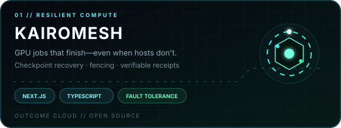
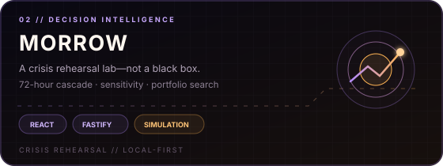
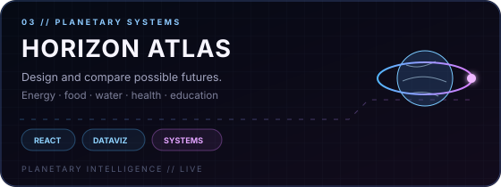
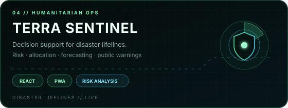
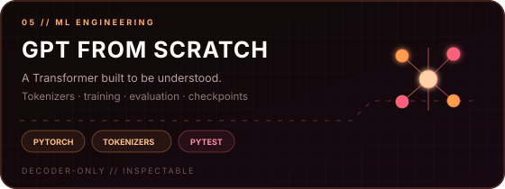
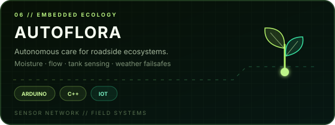

<!--
  This profile is deliberately self-contained.
  Every visual is stored in this repository; no scheduled jobs or hosted stats cards are required.
-->
   

  

  <a href="https://shaurya-malhotra-site.vercel.app/"><strong>PORTFOLIO ↗</strong></a>
  &nbsp;&nbsp;·&nbsp;&nbsp;
  <a href="https://www.linkedin.com/in/shaurya-malhotra-048555367/"><strong>LINKEDIN ↗</strong></a>
  &nbsp;&nbsp;·&nbsp;&nbsp;
  <a href="mailto:shauryamalhotra957@gmail.com"><strong>EMAIL ↗</strong></a>
  &nbsp;&nbsp;·&nbsp;&nbsp;
  <a href="https://github.com/shauryamalhotra957-wq?tab=repositories"><strong>ALL SYSTEMS ↗</strong></a>

 

<table>
  <tr>
    <td width="58%" valign="top">
      <h2>Intelligence that survives contact with reality.</h2>
      

        I'm a Computer Engineering undergraduate at <strong>Thapar Institute of Engineering and Technology</strong>.
        I turn ambitious ideas into systems people can inspect, test, and actually use—from resilient GPU orchestration
        and language models to crisis simulations, computer vision, and embedded hardware.
      

    </td>
    <td width="42%" valign="top">
      <h3>Current vectors</h3>
      

        <code>resilient compute</code> 
        <code>decision intelligence</code> 
        <code>applied AI + evaluation</code> 
        <code>edge + embedded systems</code>
      

    </td>
  </tr>
</table>

  

## Flagship systems

Six different domains. One standard: <strong>clear architecture, useful interfaces, and evidence that the system works.</strong>

<table>
  <tr>
    <td width="50%">
      
    </td>
    <td width="50%">
      
    </td>
  </tr>
  <tr>
    <td width="50%">
      
    </td>
    <td width="50%">
      
    </td>
  </tr>
  <tr>
    <td width="50%">
      
    </td>
    <td width="50%">
      
    </td>
  </tr>
</table>

Every panel is clickable · source, architecture, tests, and documentation live inside each repository

## Engineering DNA

<table>
  <tr>
    <td width="33%" valign="top">
      <h3>◈ Make it inspectable</h3>
      
Expose assumptions, constraints, failure modes, and trust boundaries. Intelligence should be explainable from interface to implementation.

    </td>
    <td width="33%" valign="top">
      <h3>◎ Design for operators</h3>
      
Accessibility, responsive behavior, privacy, offline constraints, and useful failure states are engineering requirements—not polish.

    </td>
    <td width="33%" valign="top">
      <h3>⌁ Ship with proof</h3>
      
Tests, static analysis, security checks, deterministic fixtures, visual QA, and honest documentation belong in the feature.

    </td>
  </tr>
</table>

## Runtime

  <code>Python</code>&nbsp;
  <code>TypeScript</code>&nbsp;
  <code>JavaScript</code>&nbsp;
  <code>C++</code>&nbsp;
  <code>SQL</code>&nbsp;
  <code>Dart</code>

  <code>PyTorch</code>&nbsp;
  <code>TensorFlow</code>&nbsp;
  <code>OpenCV</code>&nbsp;
  <code>FastAPI</code>&nbsp;
  <code>React</code>&nbsp;
  <code>Next.js</code>&nbsp;
  <code>Three.js</code>&nbsp;
  <code>Node.js</code>

  <code>Arduino</code>&nbsp;
  <code>Docker</code>&nbsp;
  <code>GitHub Actions</code>&nbsp;
  <code>Vitest</code>&nbsp;
  <code>Playwright</code>&nbsp;
  <code>pytest</code>

<strong>Explore the complete systems map</strong>

### AI, ML, and data

[AI Highlight Reel Maker](https://github.com/shauryamalhotra957-wq/ai-highlight-reel-maker) ·
[AI Lecture Note Taker](https://github.com/shauryamalhotra957-wq/ai-lecture-note-taker) ·
[Bank Customer Churn Prediction](https://github.com/shauryamalhotra957-wq/bank-customer-churn-prediction) ·
[DressRight AI](https://github.com/shauryamalhotra957-wq/dressright-ai) ·
[EcoConnect Vision](https://github.com/shauryamalhotra957-wq/EcoConnect-Vision) ·
[GPT From Scratch Pro](https://github.com/shauryamalhotra957-wq/gpt-from-scratch-pro) ·
[NewsCred RAG](https://github.com/shauryamalhotra957-wq/newscred-rag)

### Simulations and interactive systems

[Aegis Atlas](https://github.com/shauryamalhotra957-wq/aegis-atlas) ·
[Aegis Earth](https://github.com/shauryamalhotra957-wq/aegis-earth) ·
[HELIX Command](https://github.com/shauryamalhotra957-wq/helix-command) ·
[Horizon Atlas](https://github.com/shauryamalhotra957-wq/horizon-atlas) ·
[JARVIS](https://github.com/shauryamalhotra957-wq/jarvis) ·
[KairoMesh](https://github.com/shauryamalhotra957-wq/kairomesh) ·
[Morrow](https://github.com/shauryamalhotra957-wq/morrow) ·
[Terra Sentinel](https://github.com/shauryamalhotra957-wq/terra-sentinel)

### Embedded systems and robotics

[AutoFlora](https://github.com/shauryamalhotra957-wq/AutoFlora-An-IoT-Framework-for-Urban-Roadside-Plantation) ·
[Obstacle-Avoiding Car](https://github.com/shauryamalhotra957-wq/Obstacle-Avoiding-Car)

---

<h3 align="center">Build systems people can inspect, trust, and use.</h3>

  <a href="mailto:shauryamalhotra957@gmail.com"><strong>START A CONVERSATION</strong></a>
  &nbsp;&nbsp;·&nbsp;&nbsp;
  <a href="https://github.com/shauryamalhotra957-wq?tab=repositories"><strong>EXPLORE THE WORK</strong></a>

  Zero expiring widgets · zero scheduled generators · repository-owned motion that loops indefinitely

