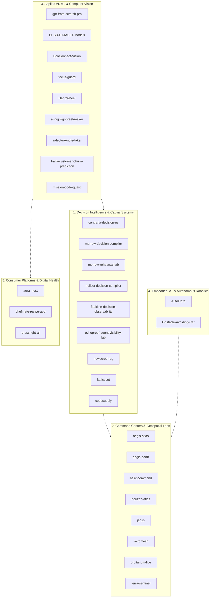

# Engineering Ecosystem: Cross-Repository Topology & System Architecture

This document formalizes the holistic architecture spanning the 32 open-source engineering systems developed by Shaurya Malhotra.

## 1. Multi-Tier Engineering Topology

## 2. Shared Resilience & Reliability Contract
Across all 32 repositories, systems implement a shared resilience contract:
- **Fault-Tolerant Circuit Breakers**: Automatic isolation of failing external dependencies.
- **Adaptive Jitter Retry**: Prevention of thundering-herd retry storms.
- **Graceful Offline Degradation**: Local-first caching ensuring uninhibited user workflow continuity.
- **Cryptographic Provenance**: Verifiable data authenticity at every layer boundary.
